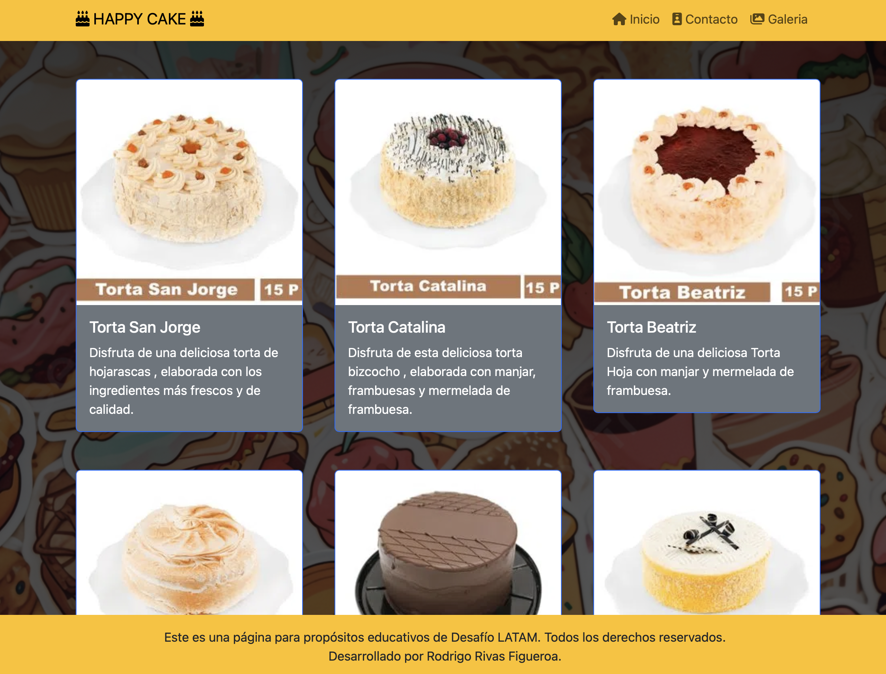
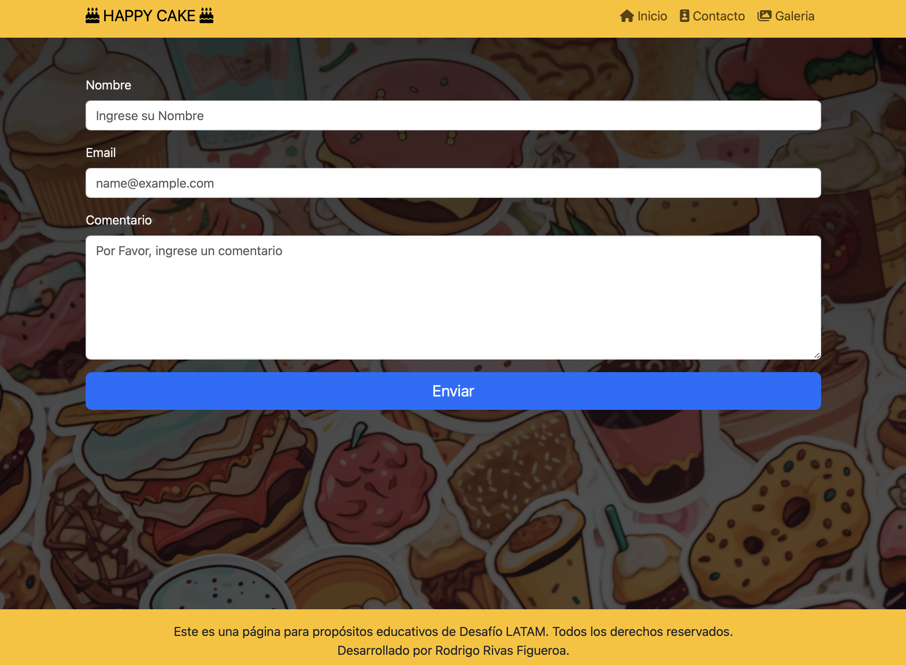

# Desafío - Happy Cake

## Descripción:
La empresa Happy Cake SPA se dedica a cocinar pasteles personalizados y ha decidido financiar la creación de una página web en donde le permita a los clientes realizar cotizaciones y ofrecer un formulario de contacto.
En este desafío deberás crear una aplicación React y utilizar React Router para ofrecer la navegación de 2 vistas basada en rutas: Home y Contacto.

